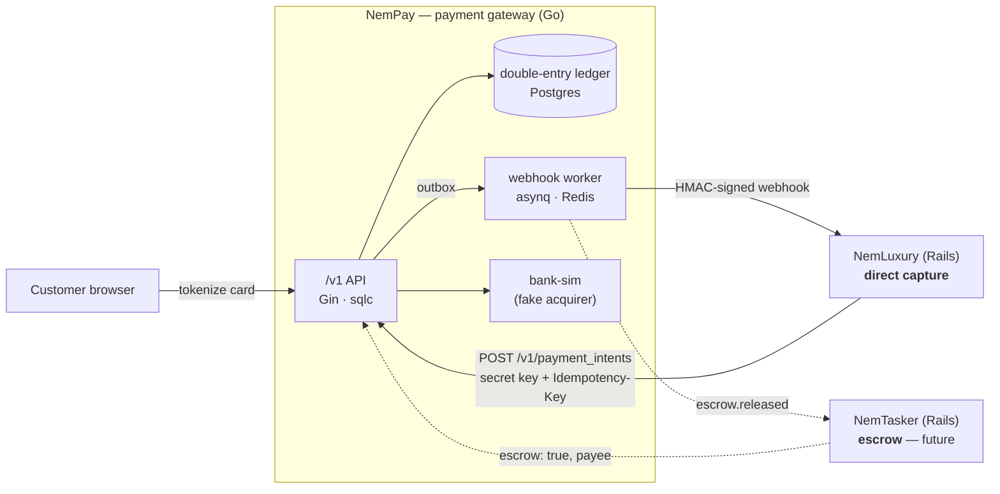
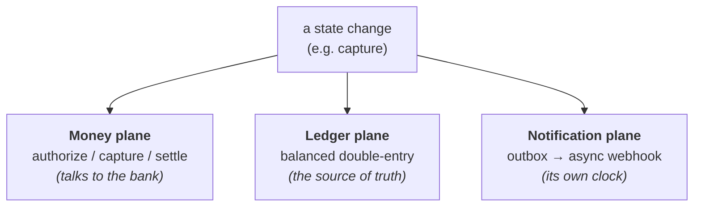
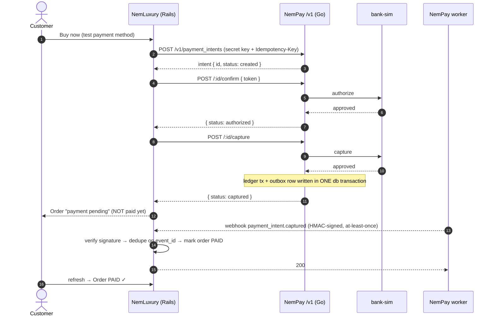

# monorepo-payment

> A from-scratch **payment platform**, built to learn how real money-movement systems work — a
> Stripe-style gateway and two contrasting merchants that integrate it, so the entire payment
> lifecycle (including **escrow**) can be exercised end-to-end on one machine.

This is a **teaching project** where correctness and clarity beat cleverness. Every architectural
choice is a deliberate system-design lesson, not an accident of convenience — idempotency, a
double-entry ledger, explicit state machines, the outbox pattern, reconciliation, and PCI-scope
boundaries are all implemented the way a production payments team would reason about them.

**Status:** Milestones **M1** (gateway) and **M2** (first merchant) are complete and verified —
**49 Go tests + 37 RSpec examples + a live end-to-end run across both apps in Docker.** Escrow
(M3/M4) is designed-for from day one and built last.

---

## Table of contents
- [What it is](#what-it-is)
- [Why it's interesting (the engineering)](#why-its-interesting-the-engineering)
- [Architecture](#architecture)
  - [The three systems](#the-three-systems)
  - [The three planes](#the-three-planes)
  - [A payment, end to end](#a-payment-end-to-end)
- [Core principles (the syllabus)](#core-principles-the-syllabus)
- [Tech stack](#tech-stack)
- [Repository layout](#repository-layout)
- [How it's built: spec-driven development](#how-its-built-spec-driven-development)
- [Testing & verification](#testing--verification)
- [Run it locally](#run-it-locally)
- [Roadmap & deliberate scope](#roadmap--deliberate-scope)

---

## What it is

Three independently-deployable services that talk over HTTP exactly as separate companies would —
no shared database, no cross-boundary reads:

- **NemPay** — a payment **gateway** (Go). It owns *everything about money*: payment intents,
  authorization, capture, a double-entry ledger, settlement, escrow, and webhooks. It never knows
  what a "supercar" or an "order" is.
- **NemLuxury** — a luxury e-commerce store (Rails) that integrates NemPay via **direct capture**:
  it sells its *own* goods, so money settles straight to it. A reference merchant integration.
- **NemTasker** — a marketplace (Rails, *future work*) that integrates NemPay via **escrow**: it
  brokers a customer and a third-party, so funds are *held* until the job is done, then released
  minus a platform fee.

The two merchants exist to exercise the **two shapes of money movement** through the *same*
gateway — that contrast is the whole point.

---

## Why it's interesting (the engineering)

Most "payment" side-projects are a thin wrapper over Stripe. This one implements the hard parts a
gateway actually has to get right:

| Concern | How it's solved here |
|---|---|
| **Retries must never double-charge** | **Insert-first idempotency**: `INSERT` against a `UNIQUE` constraint and let the DB arbitrate the race — never check-then-act (no TOCTOU). |
| **What is the true balance?** | A **double-entry ledger** is the source of truth. Balances are **derived** by summing entries (`Σdebit − Σcredit`), never stored in a mutable column — a balance you can `UPDATE` is a balance you can corrupt. |
| **Concurrent captures** | `SELECT … FOR UPDATE` on the intent row: the second capture blocks, then sees `captured` and is rejected. Exactly one ledger transaction results. |
| **A merchant being down must not roll back a payment** | The **outbox pattern**: a state change writes an event to an `outbox` table *in the same transaction*; a separate worker delivers it out-of-band (at-least-once, exponential backoff, dead-letter, HMAC-signed). |
| **Money precision** | Integer **minor units** (`int64` cents) + an ISO-4217 currency. Never floats. |
| **Can we trust the webhook?** | Receivers verify an **HMAC-SHA256 signature over the raw body** before trusting it, and **dedupe on a stable `event_id`** (delivery is at-least-once). |
| **PCI scope** | Card data (PAN) **never touches a merchant server** — the merchant only ever handles opaque payment-method tokens. |
| **Escrow without a rewrite** | The gateway is **escrow-ready by construction**: typed per-reference ledger accounts, a `settlement_mode` column, and a central state-machine map are all built in M1 (unused), so escrow is an *extension*, not a rewrite. |
| **Provable correctness** | **Reconciliation**: the internal ledger must be provable against the external "bank" at all times; for escrow, held funds must equal a segregated balance. |

---

## Architecture

### The three systems



Each service keeps its own database (NemPay on **PostgreSQL**; each merchant on its own file-based
**SQLite**). Merchants integrate over the public `/v1` HTTP API only. **Redis lives only in NemPay**,
on purpose — a real gateway delivers webhooks out-of-band via a durable queue, and modelling that
faithfully is part of the lesson.

### The three planes

A single transaction moves through three planes at different speeds — kept separate in code and in
your head:



The trick the gateway gets right: the **money** and **ledger** writes *plus* the outbox row all
commit in **one database transaction**; the **notification** plane then runs on its own clock.
Collapsing them — emitting the webhook inside the money transaction — is forbidden, because a
merchant outage would then be able to roll back a real money movement.

### A payment, end to end

The direct-capture flow (NemLuxury). Note the key lesson: the order becomes **paid only when the
verified webhook arrives** — never from the synchronous API response or a browser redirect.



Meanwhile, **settlement is asynchronous**: a periodic sweep in the worker moves `captured` intents
to `settled` on the money plane's own clock (modelling a real T+1 batch), converting the
acquirer receivable into platform cash — *settlement is not payout*.

---

## Core principles (the syllabus)

These live in NemPay and shape how merchants integrate. Each is a deliberate lesson:

1. **Idempotency on every money-mutating write** — insert-first against a `UNIQUE` constraint;
   retries are safe *by construction*.
2. **Double-entry ledger as source of truth** — append-only entries; balances are derived, never
   stored. Every money event writes one balanced transaction (`Σdebit = Σcredit`).
3. **Explicit state machines** — payment and escrow states move only along allowed edges, defined
   in one central map. No implicit jumps.
4. **Outbox + async webhooks** — state changes write to an outbox in the same transaction; a
   separate worker delivers at-least-once with backoff, dead-lettering, and HMAC signing.
5. **Money is integer minor units + a currency** — never floats.
6. **Reconciliation is mandatory** — the internal ledger must be provable against the external bank
   at all times; escrow held must equal segregated funds on hand.

### The direct-capture ledger, concretely

For a payment of amount `A` (all amounts are non-negative; each posting balances):

| Event | Debit | Credit | Meaning |
|---|---|---|---|
| `capture` | `acquirer_receivable` | `merchant_payable` | the acquirer owes us `A`; we owe the merchant `A` — no cash moved yet |
| `settle` | `platform_cash` | `acquirer_receivable` | the acquirer pays out in a batch; the receivable becomes real cash (`settle ≠ payout`) |
| `refund` | `merchant_payable` | `acquirer_receivable` / `platform_cash` | reversing entries, pre- or post-settlement |

In escrow mode (M3), the same capture code points its credit at a per-intent `escrow_liability`
account instead of `merchant_payable` — the seam is already there.

---

## Tech stack

| | NemPay (gateway) | NemLuxury (merchant) |
|---|---|---|
| **Language** | Go 1.25 | Ruby 4 / Rails 8 |
| **HTTP** | Gin | Rails MVC (server-rendered) |
| **Data** | PostgreSQL via **sqlc** (hand-written SQL → type-safe Go) | SQLite via ActiveRecord |
| **Async** | Redis + **asynq** worker (webhooks, sweeps) | none — webhooks handled synchronously |
| **Tests** | `go test` against a throwaway Postgres | RSpec (+ WebMock) |
| **Infra** | Docker Compose (Postgres, Redis, api, worker, bank-sim) | `bin/rails s` — reaches the gateway over HTTP |

**Why sqlc, not an ORM (for the money path):** payment correctness lives in SQL you can *see* — the
exact `SELECT … FOR UPDATE`, the precise transaction boundary. An ORM generates SQL at runtime and
hides the one thing that must be certain; in a ledger, code review *is* the safety mechanism.

**Why Rails for the merchants:** they own a real domain (catalogue, cart, orders) — exactly where
ActiveRecord and Rails conventions shine. The ORM boundary belongs *between* systems (gateway = sqlc
vs merchants = ActiveRecord), never inside the money system.

---

## Repository layout

```
monorepo-payment/
├── nem_pay/          Payment gateway — Go API + asynq worker + bank simulator
│   ├── api/          Gin · sqlc · double-entry ledger · idempotency · outbox
│   ├── bank-sim/     fake acquirer (approved / declined / timeout)
│   └── docker-compose.yml   one command brings up the whole gateway
├── Nem_luxury/       Direct-capture merchant (Rails 8) — the reference integration
├── Nem_tasker/       Escrow merchant (Rails) — future work
├── specs/            WHAT & WHY — the contract for each feature (spec-first)
├── plans/            HOW — architecture, decisions, task breakdown, roadmap
└── CLAUDE.md         repo-wide engineering rules (the "constitution")
```

---

## How it's built: spec-driven development

This repo is built **spec-first** — the spec is the source of truth, code is derived from it. Three
artifact layers with three homes:

- **Constitution** — the `CLAUDE.md` files: non-negotiable rules.
- **Spec** — `specs/<NNN>-<slug>/spec.md`: the WHAT and WHY (scope, behaviours, testable acceptance
  criteria). No HOW.
- **Plan & tasks** — `plans/<NNN>-<slug>/`: the HOW (architecture, decisions with alternatives
  considered, and a task-by-task breakdown with test matrices).

Every feature is `spec → plan → tasks → implement → verify`, and "done" means the spec's acceptance
criteria pass — not merely "it runs". Browse [`specs/`](./specs) and [`plans/`](./plans) to see the
reasoning behind each decision, including the trade-offs that were weighed and rejected.

---

## Testing & verification

Correctness is demonstrated, not asserted:

- **NemPay:** 49 tests against a real (throwaway) Postgres — including the concurrency lesson (N
  goroutines racing a single capture → exactly one ledger transaction), the balanced-transaction
  property (every posting sums to zero), the authorize-**timeout** path ("did the bank receive
  it?"), and idempotent-replay.
- **NemLuxury:** 37 RSpec examples covering the happy path plus every failure mode the design
  exists to defend — declined card, missing webhook, duplicate webhook, tampered signature, and
  double-submitted checkout.
- **Live end-to-end:** both apps booted together in Docker and driven through a real purchase — the
  order flips to `paid` only when the asynchronous, HMAC-signed webhook is delivered from the
  gateway container to the merchant and verified.

```bash
# Gateway: spins up a throwaway Postgres, applies migrations, runs the suite
cd nem_pay/api && make test-db

# Merchant: unit + request specs (gateway stubbed)
cd Nem_luxury && bundle exec rspec
```

---

## Run it locally

```bash
# 1. Bring up the whole gateway (Postgres + Redis + api + worker + bank-sim)
cd nem_pay
docker-compose up --build
#    → /v1 listening on http://localhost:8080; dev API keys printed in the logs

# 2. Start the merchant, pointed at the gateway
cd ../Nem_luxury
bin/setup
NEMPAY_API_URL=http://localhost:8080 \
NEMPAY_SECRET_KEY=sk_test_nempay_secret \
NEMPAY_WEBHOOK_SECRET=whsec_nemluxury_dev \
bin/rails server -p 3000
#    → open http://localhost:3000, buy an item, watch the order move to "Paid"
```

The gateway is also fully drivable with `curl` alone (no merchant required) — see
[`nem_pay/CLAUDE.md`](./nem_pay/CLAUDE.md).

---

## Roadmap & deliberate scope

Built as a vertical slice — get one money flow working end-to-end, then extend the *same* gateway:

| # | Milestone | Status |
|---|---|---|
| **M1** | NemPay — direct-capture gateway (escrow-ready) | ✅ done |
| **M2** | NemLuxury — direct-capture integration | ✅ done |
| **M3** | NemPay — escrow mode (`held_in_escrow → released`, segregation invariant) | planned |
| **M4** | NemTasker — escrow marketplace integration | planned |

**Consciously out of scope** (documented, not forgotten): partial-release / auto-release-on-timeout
for escrow, disputes/chargebacks, payout batching to real bank rails, multi-currency aggregation,
and a real card-tokenization SDK. Knowing *what not to build yet* — and writing it down — is part of
the discipline.

---

<sub>Built as a system-design study of how payment gateways actually work. The bank is simulated;
no real card networks or funds are involved.</sub>
